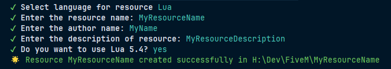
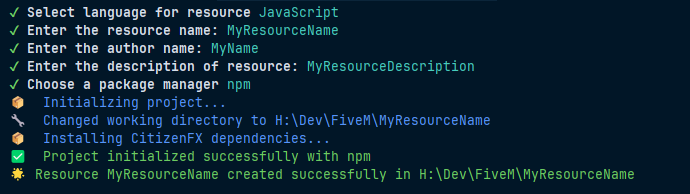
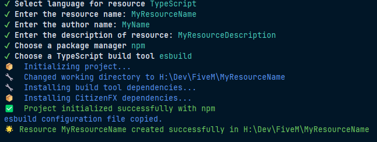

# fivem-resource-maker

A CLI Tool to quickly generate FiveM resources with support for JavaScript, TypeScript, and Lua.

## Table of Contents

- [Installation](#installation)
- [Usage](#usage)
- [Features](#features)
- [Examples](#examples)
- [Roadmap](#roadmap)
- [Contributing](#contributing)
- [License](#license)
- [Contact](#contact)

## Installation

You can install `fivem-resource-maker` globally using npm or pnpm:

```bash
npm install -g fivem-resource-maker # If you use npm
pnpm install -g fivem-resource-maker # If you use pnpm
```

## Usage

Run the CLI tool to generate a new FiveM resource:

```bash
npx fivem-resource-maker # If you use npm
pnpx fivem-resource-maker # If you use pnpm
```

## Features

- Supports multiple programming languages: JavaScript, TypeScript, and Lua.
- Easy-to-use CLI interface with guided prompts.
- Automatically sets up project structure with necessary files.
- Option to use different package managers: npm, yarn, or pnpm.
- Customizable build tools for TypeScript projects: esbuild, tsc, webpack, and rollup.
- Option to include Lua 5.4 support in Lua projects.
- Option to use FxV2 OAL in Lua projects.

## Examples

### Generating a Lua Resource


### Generating a JavaScript Resource


### Generating a TypeScript Resource


## Roadmap

🕑: to do 🚧: wip ✅: finished

| Framework / Library | CSS Framework | Language   | Avancement |
|---------------------|---------------|------------|------------|
| vanilla             | none          | JavaScript | 🕑         |
| vanilla             | none          | TypeScript | 🕑         |
| vanilla             | bootstrap     | JavaScript | 🕑         |
| vanilla             | bootstrap     | TypeScript | 🕑         |
| vanilla             | tailwind      | JavaScript | 🕑         |
| vanilla             | tailwind      | TypeScript | 🕑         |
| vanilla             | sass          | JavaScript | 🕑         |
| vanilla             | sass          | TypeScript | 🕑         |
| vanilla             | less          | JavaScript | 🕑         |
| vanilla             | less          | TypeScript | 🕑         |
| react               | none          | JavaScript | 🕑         |
| react               | none          | TypeScript | 🕑         |
| react               | bootstrap     | JavaScript | 🕑         |
| react               | bootstrap     | TypeScript | 🕑         |
| react               | tailwind      | JavaScript | 🕑         |
| react               | tailwind      | TypeScript | 🕑         |
| react               | sass          | JavaScript | 🕑         |
| react               | sass          | TypeScript | 🕑         |
| react               | less          | JavaScript | 🕑         |
| react               | less          | TypeScript | 🕑         |
| vue                 | none          | JavaScript | 🕑         |
| vue                 | none          | TypeScript | 🕑         |
| vue                 | bootstrap     | JavaScript | 🕑         |
| vue                 | bootstrap     | TypeScript | 🕑         |
| vue                 | tailwind      | JavaScript | 🕑         |
| vue                 | tailwind      | TypeScript | 🕑         |
| vue                 | sass          | JavaScript | 🕑         |
| vue                 | sass          | TypeScript | 🕑         |
| vue                 | less          | JavaScript | 🕑         |
| vue                 | less          | TypeScript | 🕑         |
| svelte              | none          | JavaScript | 🕑         |
| svelte              | none          | TypeScript | 🕑         |
| svelte              | bootstrap     | JavaScript | 🕑         |
| svelte              | bootstrap     | TypeScript | 🕑         |
| svelte              | tailwind      | JavaScript | 🕑         |
| svelte              | tailwind      | TypeScript | 🕑         |
| svelte              | sass          | JavaScript | 🕑         |
| svelte              | sass          | TypeScript | 🕑         |
| svelte              | less          | JavaScript | 🕑         |
| svelte              | less          | TypeScript | 🕑         |
| angular             | none          | JavaScript | 🕑         |
| angular             | none          | TypeScript | 🕑         |
| angular             | bootstrap     | JavaScript | 🕑         |
| angular             | bootstrap     | TypeScript | 🕑         |
| angular             | tailwind      | JavaScript | 🕑         |
| angular             | tailwind      | TypeScript | 🕑         |
| angular             | sass          | JavaScript | 🕑         |
| angular             | sass          | TypeScript | 🕑         |
| angular             | less          | JavaScript | 🕑         |
| angular             | less          | TypeScript | 🕑         |


## Contributing

Contributions are welcome! Please follow these steps to contribute:

1. Fork the repository.
2. Create a new branch for your feature or bug fix.
3. Make your changes and commit them.
4. Push yo your branch and create a pull request.

## License

This project is licensed under the **MIT** license - see the [License](./LICENSE) file for details

## Contact

If you have any questions or comments, please don't hesitate to contact me or to open a file in the repository.

You can also find me on [GitHub](https://github.com/Purpose-Dev) for more projects.